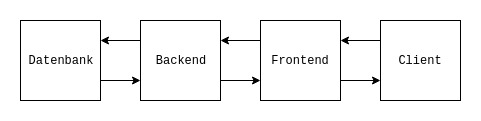
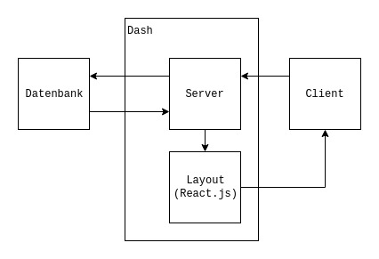
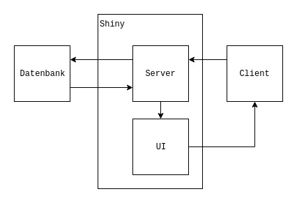

```{r setup, include=FALSE}
knitr::opts_chunk$set(echo = FALSE)
```

## Agenda

### A) Mögliche Designs
1. Klassiker `r icon::fa("python")` + `r icon::fa("vuejs")` + `r icon::fa("chart-area")`
2. Dash `r icon::fa("python")`
3. Shiny `r icon::fa("r-project")`

### B) Team Up 

## Klassiker {.columns-2}

### Backend `r icon::fa("python")`

- REST API mit Python 

### Frontend `r icon::fa("vuejs")` + `r icon::fa("chart-area")`

- Web Application mit Vue JS 
- D3/Chart/Plotly

```{r, out.width='100%', fig.align='center'}

```


## Dash

- komplett in `r icon::fa("python")` 

```{r, out.width='50%', fig.align='left'}

```

## Shiny

- komplett in `r icon::fa("r-project")`

```{r, out.width='50%', fig.align='left'}

```

## Aufteilung in Teams

### SQL Team
- Wie lösen wir die Fragestellung?

### Backend Team
- Wie können wir die Daten umwandeln, sodass wir sie darstellen können?

### Frontend/Design Team
- Wie stellen wir die Daten dar?