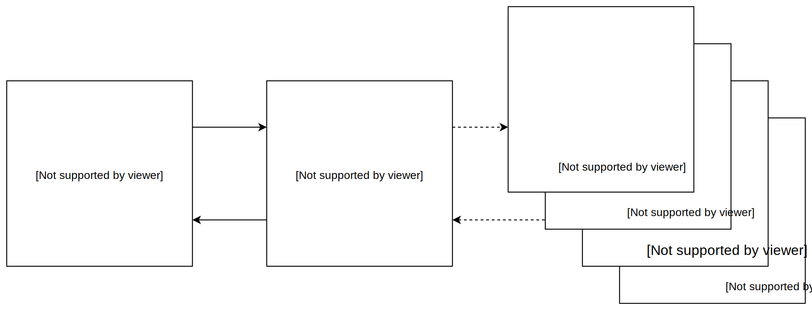

```{r setup, include=FALSE}
knitr::opts_chunk$set(echo = FALSE)
```

## https://pollev.com/jandix570

1. Was erwartest du vom Workshop?
2. Welche "Sprachen" sprichst du?
3. Was für einen Hintergrund hast du? (z.B.: Sozialwissenschaftler*in)

## Agenda

1. Model
2. JavaScript
3. Server (Backend)
4. Client (Frontend)

## Model

```{r, out.width='100%', fig.align='center'}

```

# JavaScript

## https://pollev.com/jandix570

1. Was verbindet ihr mit JavaScript?

## Warum eigentlich JavaScript?


## Ein paar Grundlagen (1)

```js
// variables are always definded using 'var'
var x           = 20;
var fruit       = 'Apples';
var otherFruits = 'Pears';

// simple math
var y = x * 20;
var z = y + 30 / 10.5;
var m = Math.round(z);

// string manipulation
var sentence = fruit  + ' are not ' + otherFruits + '!';

// simple debuging in browser
console.log(fruits);
```

## Ein paar Grundlagen (2)

```js
// define arrays
var twitterFollower = [1, 2, 3, 4];
// access n-th item in array
var follower = twitterFollower[2];
// add item to the end of an array
twitterFollower.push(3);

// define objects
var twitterTimeLine = {
  date:     ['2016-05-18', '2016-05-19', '2016-05-20', '2016-05-21', '2016-05-22'],
  follower: twitterFollower
};
// access elements in an object
twitterTimeLine.date
// add new element to an object
twitterTimeLine.likes = 32;
``` 


## Ein paar Grundlagen (3)

```js
// map
twitterTimeLine.parsedDate = twitterTimeLine.date.map(function (e) { return new Date(e) });

// reduce
twitterTimeLine.followerSum = twitterTimeLine.follower.reduce(function (a, b) { return a + b }, 0)
``` 


## ES6 oder auch der verflixte Internet Explorer

- neue Standards
- wird nicht vom Internet Explorer (10% Marktanteil) unterstützt (https://netmarketshare.com/)
- kann durch Compiler/Polyfills erweitert werden (z.B.: Babel)
- [Kompatibilität nachschauen](http://kangax.github.io/compat-table/es6/)

### Beispiel:

```js
// define new variables
let fruit = 'apple';
const pi = 3.1415; // does not work for childrens of objects
```
## DIY

1. Initialisiere die Variable `fruits` mit dem Array `['apple', 'mango', 'pear']`.
2. Füge einen weitere beliebige Frucht zu dem Array `fruits` hinzu.
3. Erstelle ein Objekt `basket` und füge das Array `fruits` hinzu.
4. Erstelle ein weiteres Array `price` innerhalb von `basket` mit den Werten `[3, 4, 20, 1]`.
5. Errechne die Summe des Warenkorbs und speicher sie in der Variablen `total`.

# Server (Backend)

## https://pollev.com/jandix570

1. Was ist ein Server?

## Was ist ein Server? {.columns-2}

### Wie sehen CorrelAid Server aus?

- Ubuntu 16.04/18.04
- NGINX (Webserver)
- RStudio
- Jupyter Notebooks
- Node JS
- SQL (Maria DB/Postgres)

### Wo bekommt man das?

- Amazon Web Services
- Google Cloud
- Microsoft Azure

- BWCloud


## Node JS


# Client (Frontend)

## https://pollev.com/jandix570

1. Was ist ein Frontend?

## Wie kann ein Frontend aussehen?

- das Frontend kann 


