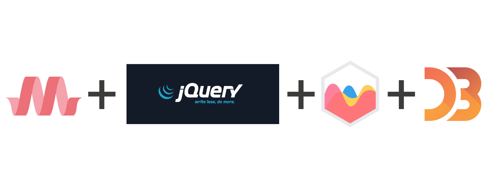

```{r setup, include=FALSE}
knitr::opts_chunk$set(echo = FALSE)
```

## Mentimeter

Gehe auf [www.menti.com](www.menti.com) und gebe den Code `78 31 82` ein.

1. Was erwartest du vom Workshop?
2. Welche "Sprachen" sprichst du?
3. Was für einen Hintergrund hast du? (z.B.: Sozialwissenschaftler*in)

## Agenda

1. Model
2. JavaScript
3. Server (Backend)
4. Client (Frontend)

## Model

```{r, out.width='100%', fig.align='center'}

```

# JavaScript

## Mentimeter

Gehe auf [www.menti.com](www.menti.com) und gebe den Code `78 31 82` ein.

1. Was verbindest du mit JavaScript?

## Warum eigentlich JavaScript?

```{r, out.width='100%', fig.align='center'}

```

## Ein paar Grundlagen (1)

```js
// variables are always definded using 'var'
var x           = 20;
var fruit       = 'Apples';
var otherFruits = 'Pears';

// simple math
var y = x * 20;
var z = y + 30 / 10.5;
var m = Math.round(z);

// string manipulation
var sentence = fruit  + ' are not ' + otherFruits + '!';

// simple debuging in browser
console.log(fruits);
```

## Ein paar Grundlagen (2)

```js
// define arrays
var twitterFollower = [1, 2, 3, 4];
// access n-th item in array
var follower = twitterFollower[2];
// add item to the end of an array
twitterFollower.push(3);

// define objects
var twitterTimeLine = {
  date:     ['2016-05-18', '2016-05-19', '2016-05-20', '2016-05-21', '2016-05-22'],
  follower: twitterFollower
};
// access elements in an object
twitterTimeLine.date
// add new element to an object
twitterTimeLine.likes = 32;
``` 


## Ein paar Grundlagen (3)

```js
// define a function
function adder (a, b) {
  return a + b;
}

// creates a new array with the results of calling a function on every element in an array
twitterTimeLine.parsedDate = twitterTimeLine.date.map(function (e) { 
  return new Date(e) 
});

// executes a reducer function on each member of the array resulting in a single output value
twitterTimeLine.followerSum = twitterTimeLine.follower.reduce(function (a, b) { 
  return a + b 
}, 0);
``` 


## ES6 oder auch der verflixte Internet Explorer

- neue Standards
- wird nicht vom Internet Explorer (10% Marktanteil) unterstützt (https://netmarketshare.com/)
- kann durch Compiler/Polyfills erweitert werden (z.B.: Babel)
- [Kompatibilität nachschauen](http://kangax.github.io/compat-table/es6/)

### Beispiel:

```js
// define new variables
let fruit = 'apple';
const pi = 3.1415; // does not work for childrens of objects
```
## DIY

1. Initialisiere die Variable `fruits` mit dem Array `['apple', 'mango', 'pear']`.
2. Füge einen weitere beliebige Frucht zu dem Array `fruits` hinzu.
3. Erstelle ein Objekt `basket` und füge das Array `fruits` hinzu.
4. Erstelle ein weiteres Array `price` innerhalb von `basket` mit den Werten `[3, 4, 20, 1]`.
5. Errechne die Summe des Warenkorbs und speicher sie in der Variablen `total`.

# Server (Backend)

## Mentimeter

Gehe auf [www.menti.com](www.menti.com) und gebe den Code `78 31 82` ein.

1. Was ist ein Server?

## Was ist ein Server? {.columns-2}

### Wie sehen CorrelAid Server aus?

- Ubuntu 16.04/18.04
- NGINX (Webserver)
- RStudio
- Jupyter Notebooks
- Node JS
- SQL (Maria DB/Postgres)

### Wo bekommt man das?

- Amazon Web Services
- Google Cloud
- Microsoft Azure

- BWCloud

# Client (Frontend)

## Mentimeter

Gehe auf [www.menti.com](www.menti.com) und gebe den Code `78 31 82` ein.

1. Was ist ein Frontend?

## Was ist der Client?

```{r, out.width='100%', fig.align='center'}

```

## GUI & SPAs

```{r, out.width='100%', fig.align='center'}

```

## CSS Frameworks & DOM Manipulation

```{r, out.width='100%', fig.align='center'}

```

## Visualisation Frameworks

```{r, out.width='100%', fig.align='center'}
knitr::include_graphics('images/visualisation.jpg')
```

## Non-blocking/Asynchronous

```{r, out.width='87%', fig.align='center'}

```

## Asynchronous Code & Callbacks (1)

```js
$.get('https://api.correlaid.org/facebook')
    .done(function (response) {
        console.info('Success: Facebook data are successfully fetched.');
        addDataSet(lineChart, response.data, 'Facebook', '#0e1f56');
    })
    .fail(function() {
        console.info('Error: Could not fetch Facbook data.')
    });
```

## Asynchronous Code & Callbacks (2)

```js
var URL = 'https://nominatim.openstreetmap.org/search/';
var params = {
    city: 'Mannheim',
    country: 'Germany,
    format: 'json'
};
$.get(URL, params)
    .done(function (response) {
        console.log('Lat: ' + response[0].lat + ', Lon: ' + response[0].lon);
    });
```

## DIY (1)

```{r, out.width='100%', fig.align='center'}

```

## DIY (2)

### Line Chart
1. Öffne die Datei `frontend/assets/js/line-chart.js` in einem Text-Editior deiner Wahl.
2. Lade die Zeitreihe aus dem Endpunkt `/mailchimp`.
3. Visualisiere die Zeitreihe aus der vorherigen Aufgabe mit Hilfe der `addDataSet()` Funktion.
 
### Karte
1. Öffne die Datei `frontend/assets/js/map.js` in einem Text-Editior deiner Wahl.
2. Lade die Standorte der Lokal Chapters aus dem Endpunkt `/local-chapters`.
3. Lade für jede Stadt die Koordinaten aus der OpenStreetMap API herunter.
4. Visualisiere die Standorte aus der vorherigen Aufgabe mit Hilfe der `addDataPoint()` Funktion.

## Ressourcen {.columns-2}

### Frameworks
- [jQuery](https://api.jquery.com/)
- [Chart JS](https://www.chartjs.org/)
- [D3 JS](https://d3js.org/)
- [Bootstrap](https://getbootstrap.com/docs/4.1/getting-started/introduction/)
- [Material CSS](https://materializecss.com/)

### Online Kurse
- [JavaScript lernen (kostenlos)](https://www.codecademy.com/learn/introduction-to-javascript)
- [Vue lernen (Udemy)](https://www.udemy.com/vuejs-2-the-complete-guide/)
- [React lernen (Udemy)](https://www.udemy.com/react-the-complete-guide-incl-redux/)
- [Angular lernen (Udemy)](https://www.udemy.com/angular-essentials-angular-2-angular-4-with-typescript/)
- [Node JS lernen (Udemy)](https://www.udemy.com/nodejs-the-complete-guide/)


# Vielen Dank!

